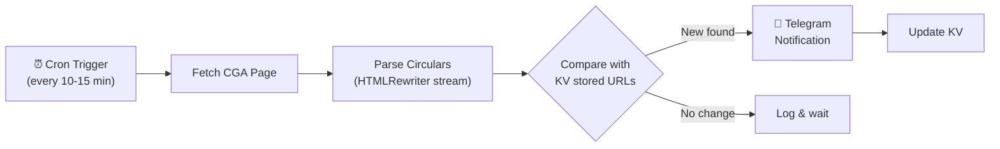

# CGA Circulars Monitor (Cloudflare Worker)

An automated serverless monitor that checks the Controller General of Accounts (CGA) circulars website for new updates and sends instant push notifications via Telegram.

---

## 🔒 Security Notice (Bot Token, Chat ID & Admin Token)
> [!IMPORTANT]
> Your **Telegram Bot Token**, **Chat ID**, and **Admin Token** (dashboard trigger password) are **not stored** in this code repository.
>
> They are uploaded directly to Cloudflare's secure servers as encrypted **Worker Secrets** using the Cloudflare CLI. At runtime, Cloudflare securely injects them into the execution environment. This ensures your credentials remain completely private and are never leaked to GitHub or plaintext config files.

---

## How It Works



1. **Trigger**: Cloudflare runs the worker automatically on a scheduled cron (optimized for weekdays and quiet times).
2. **Scraping**: The worker fetches the HTML content of the CGA Orders/Circulars page.
3. **Parsing**: A streaming `HTMLRewriter` parser extracts and filters all circular titles and document URLs, resolving them relative to the page URL.
4. **State Management**: The worker compares the list of current URLs against a database of previously seen URLs stored in **Cloudflare KV**.
5. **Alerting**: If new URLs are detected, it builds length-restricted chunks and sends them to your Telegram chat using the Telegram Bot API. It then updates the KV database with the new URLs.

---

## Project Structure

```
├── src/
│   └── index.js      # Main worker script (fetching, parsing, and alerting logic)
├── package.json      # Node.js dependencies (wrangler CLI for deployment)
├── wrangler.toml     # Cloudflare Worker configuration (cron scheduler, KV bindings)
└── .gitignore        # Tells git to ignore local caches and node_modules
```

---

## Web Dashboard & Endpoints

This worker exposes a clean, secure HTTP web dashboard and API endpoints:

* **`/` (Status Dashboard)**: A dark-mode web page showing:
  - System Health Status & Last Check Timestamp
  - Total Circulars Tracked & Count of New Circulars found in the last run
  - **📄 Last 10 Updates**: Interactive list showing the 10 most recent CGA circular updates detected, complete with direct PDF links and detection timestamps.
  - **"Run Check Now" Button**: Clickable button that prompts for your admin password (`ADMIN_TOKEN`) to securely trigger an on-demand check directly from your browser.
* **`/recent`**: Returns the 10 most recent circulars detected as a clean JSON array (`title`, `url`, `detectedAt`).
* **`/status`**: Returns the raw JSON status metadata representing worker health and execution statistics.
* **`/health`**: External health check endpoint for UptimeRobot / Cronitor. Returns HTTP `200 OK` when healthy, and HTTP `503 Service Unavailable` when degraded.
* **`/webhook`**: Telegram Bot Webhook endpoint. Authenticates incoming updates via `X-Telegram-Bot-Api-Secret-Token` header and processes interactive commands (`/status`, `/recent`, `/check`, `/forcelast10`, `/help`).
* **`/check`**: Manually triggers a circulars check in the background (`202 Accepted`, POST method required). Requires bearer token authentication (`Authorization: Bearer <ADMIN_TOKEN>`).

---

## Cloudflare Free Limits Reference

This project runs 100% on the **Cloudflare Free Tier** and uses minimal resources:

| Feature | Cloudflare Free Limit | This Worker Uses | % Used |
|---|---|---|---|
| Worker Requests | 100,000 / day | ~96 / day | **0.09%** |
| KV Reads | 100,000 / day | ~96 / day | **0.09%** |
| KV Writes | 1,000 / day | ~96-192 / day | **9.6% - 19.2%** |

*Note: KV Writes occur on average once per run for metadata heartbeat updates, and twice per run only when new circulars are found (updating `seen_urls` + `meta`).*

---

## Setup & Local Development Commands

If you ever need to set this up again or update the code:

### Install dependencies
```bash
npm install
```

### Run local dev server
```bash
npx wrangler dev
```

### Deploy updates to Cloudflare
```bash
npx wrangler deploy
```

### Update Secrets
```bash
npx wrangler secret put TELEGRAM_BOT_TOKEN
npx wrangler secret put TELEGRAM_CHAT_ID
npx wrangler secret put ADMIN_TOKEN
```
